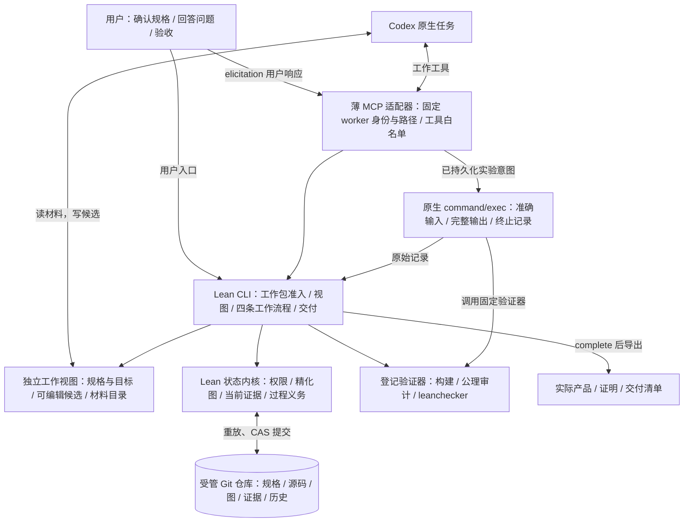

# Axiward 0.2 架构

**正式状态只有一个来源：受管项目 Git 仓库中的可重放历史。** 项目使用普通签出布局；工作视图和适配器都不是状态 authority。

## 控制器、开发仓库与受管项目

| 对象 | 含义 |
| --- | --- |
| 已运行的控制器 | 一个确定版本的 Axiward 程序，负责接纳正式操作。 |
| Axiward 开发仓库 | Axiward 软件自身的源码；当前尚未受 Axiward 管控。 |
| 受管项目仓库 | 该实例管理的开发工作，例如 FIFO；将来也可以是 Axiward 自身。 |

自我管理时，版本 A 管理产生版本 B 的源码仓库。修改 B 的源码不会修改正在运行的 A；接纳 B、交付 B、切换运行版本是不同事件。本轮发布范围不要求自动升级机制。

Git 提供文件内容、不可变快照、历史及引用更新。Axiward 解释规格、工作包、证据和完成条件，核准状态转换，再把状态与相关材料一起提交。Git 中存在某份文件本身不表示它已核验或目标已完成；回退 Git 也不能撤销已经发生的外部效果。

## 实现与数据流

| 部分 | 职责与边界 |
| --- | --- |
| `Model` / `Transition` / `Workflow` / `Engine` | 纯状态转换；图完整性、证据接纳、角色和流程规则。 |
| `Git` | 同一条历史保存全部正式状态；比较旧版本提交，冲突重读；持锁同步普通签出，拒绝覆盖本地草稿；恢复时重放并检查内容绑定。 |
| `Verifier` / `Refinement` / `FifoPolicy` | 固定 FIFO 验证契约；依赖引用、封存源码、证明、构建产物和工具摘要。 |
| `Controller` / `FlowIO` | 真实 IO 与核验流程；登记、执行、记录、向上组合。 |
| `Diagnostics` | 从不可变核验证据提取原始 Lean 消息与位置，不重跑检查、不建立诊断状态。 |
| `Interface` / `Main` | Worker 指定节点与动作后的领包入口、固定快照材料、worker 视图、用户管理命令、交付导出。 |
| `adapter/server.py` / `native.py` | 原生 MCP 和进程协议；不自主调度、不持有权威状态、不开放管理员工具。 |

用户通道与 worker 工具分离。包根放当前动作的候选、规格、目标及唯一说明 `AGENTS.md`；`.codex/` 放连接配置，包内 `.axiward/` 放视图、按需导出的证据与材料、临时文件。封存使用文件白名单，元数据不混入候选。`.view/<唯一目录>/` 的启动配置绑定 worker 身份；空空间首次领取后绑定一个包，新包使用另一个空间与 session。原包可在原空间恢复，绑定和正式状态从 Git 读取，不靠可写的 `view.json`；候选仅在首次领取时填充，恢复不覆盖草稿或补回已删候选。活动包写操作仍要求原 owner。MCP 用户答复进入原调用并存于 Git。包输入保持领取快照，`current/` 记录与固定的 `node/` 材料明确区分。

每次响应的当前状态与交接共用一次 `Git.load` 得到的版本：从 `main` 读取日志，重放纯转换并核对内容绑定，再生成 JSON，不重新执行历史实验或证明核验。不同请求可以观察到不同提交，同一响应不能混用版本。查询不写 Git、不消费消息，也不转移活动包归属。

包级交接覆盖本目标、相关当前祖先与实际依赖，直接给出关键决定、尝试结局和未解决事项；长日志按需导出。每次交接完整提供必要内容，不依赖 worker 记忆或已读状态。失败交接直接包含已保存的 Lean 原始诊断、可解析的位置、原始消息中已有的目标与局部前提，以及实际被检快照和完整证据入口；访问拒绝对正文及快照入口同样生效。决定保留原目标、版本和来源，并重新计算当前适用性；展示祖先或其他 worker 的决定不会扩大授权。必要材料不可见时明确报告缺失，不以任意条数截断冒充完整交接。

项目根正常签出正式内容，`.axiward/` 受版本管理，`.gitignore` 排除 `.view/`、`.checks/` 与 `delivery/`。私有索引、收件副本、传输日志和锁放在 `.git/`。正式写入先确认 checkout 不覆盖本地修改，再推进 `main` 并同步签出；若两步之间中断，`.git/` 内的临时记录只用于在下一次写请求时补齐签出。项目真值始终来自提交，读取不触发修复。

正式共享源码位于 `source/`，其树摘要从接纳历史推导并在加载时核对。包领取时的源码树是固定基准；控制器用 Git `merge-tree` 将封存候选与最新共享源码三方合并，管理状态不参加源码合并。内容冲突结束本包并保存原候选、冲突树和原因。无冲突时，在实际合并树上核验新目标及当前路线所有已接纳目标；FIFO 适配器生成这些条款的联合 gate，完整构建、审计和重放一次，为各目标保存绑定同份源码的凭据。尚未完成的目标不加入联合 gate。

接纳与已有凭据更新共用一次比较旧 HEAD 的提交。核验期间任何正式提交竞争都会阻止旧结果发布，原封存包保留，重试时重新合并核验；不能只重放状态转换复用旧核验结果。父组合直接核验当前共享源码，不再选择某个子实现或拼装独立证明模块。

路线变更后，状态和交接的 `invalidatedPackages` 按当前实际可达节点给出包、owner 和原因。Discussion agent 通过 Codex 停止相应 worker，再调用控制端 `reclaim`；Axiward 不管理 Codex 进程。仍被其他当前路线依赖的共享节点不会失效，旧 worker 停止或包回收不新增 `complete` 等待条件。

探索中的原始执行记录来自 [Codex `command/exec`](https://developers.openai.com/codex/app-server)，模型解释另存。实验意图先提交，只有成功创建意图的调用方发起执行；缺少结果时不盲重跑。

Worker 当前使用用户批准的完全访问模式。`.view/<目录>/` 保存包工作材料，生成说明要求 worker 只编辑本包候选、通过 Axiward 取得材料和提交，不直接操作正式仓库、其他包、控制端或适配器。这些是操作约定，不是操作系统强制隔离。MCP 入口继续检查参数、包归属和候选路径，并在封存前读取实际输入内容。

核验副本位于项目根 `.checks/<run>/snapshot/`，默认交付在 `delivery/`，两者和 `.view/` 都被新项目的 `.gitignore` 排除；说明约定要求 worker 不直接操作核验副本。Lean 编译与核验仍通过既有原生受限进程运行；这限制核验进程本身，不提供对完全访问 worker 的隔离。Git 索引与正式状态由控制端维护。

原生核验调用使用项目内的 OS 文件锁，避免 Windows 为同一项目并发配置权限时发生竞争。锁随句柄释放，不成为第二份项目状态；不同项目不共享此锁。

外部信任前提包括用户根规格、登记规范、CLI 和适配器未被绕过或改写、Git、完整 Lean 工具链、Codex 原生进程服务和操作系统。当前 worker 的行为遵守依赖说明约定；本轮跳过权限隔离检查。
