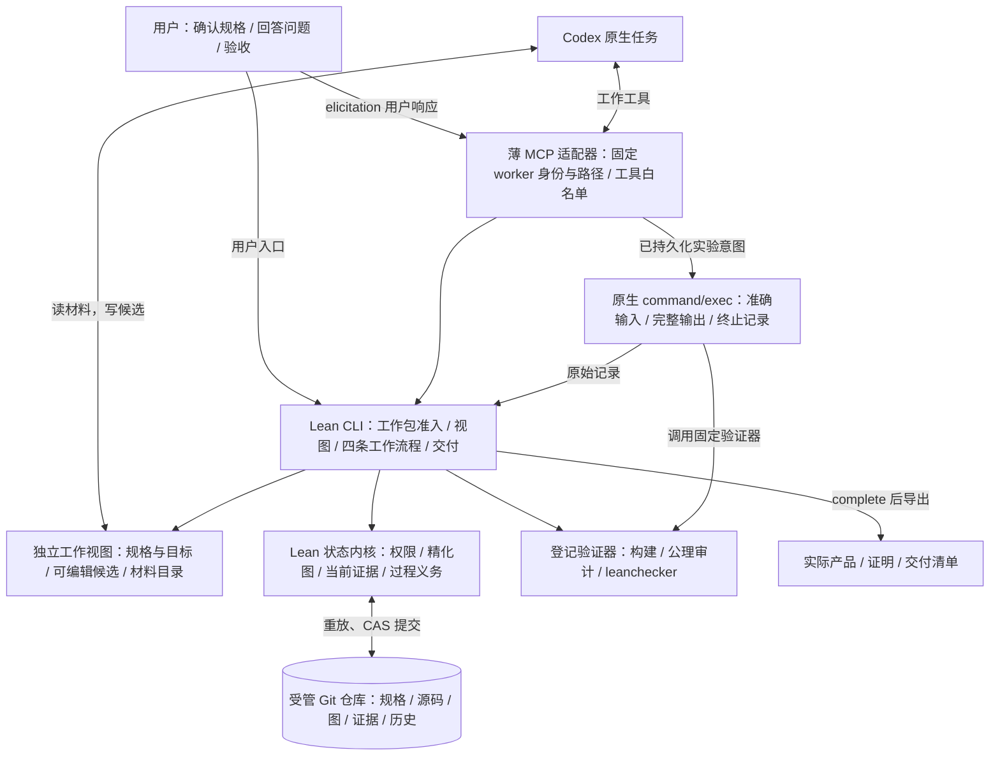

# Axiward 0.2 架构

**正式状态只有一个来源：受管项目 Git 仓库中的可重放历史。** 项目使用普通签出布局；工作视图和适配器都不是状态 authority。

| 部分 | 职责与边界 |
| --- | --- |
| `Model` / `Transition` / `Workflow` / `Engine` | 纯状态转换；图完整性、证据接纳、角色和流程规则。 |
| `Git` | 同一条历史保存全部正式状态；比较旧版本提交，冲突重读；持锁同步普通签出，拒绝覆盖本地草稿；恢复时重放并检查内容绑定。 |
| `Verifier` / `Refinement` / `FifoPolicy` | 固定 FIFO 验证契约；依赖引用、封存源码、证明、构建产物和工具摘要。 |
| `Controller` / `FlowIO` | 真实 IO 与核验流程；登记、执行、记录、向上组合。 |
| `Interface` / `Main` | Worker 指定节点与动作后的领包入口、固定快照材料、worker 视图、用户管理命令、交付导出。 |
| `adapter/server.py` / `native.py` | 原生 MCP 和进程协议；不自主调度、不持有权威状态、不开放管理员工具。 |

用户通道与 worker 工具分离。`.view/<唯一目录>/` 的启动配置绑定 worker 身份；空空间首次领取后绑定一个包，每个新包使用另一个空间与 session。原包可在原空间恢复，绑定从 Git 分配历史读取，不靠可写文件标记。MCP 用户提问的回包进入原调用；决定存于 Git。`status` 和包视图从同一个当前版本计算完整交接，按目标、版本和访问权限提供决定，不按提问者或已读状态过滤。包输入仍绑定领取快照；`current/` 记录与固定的 `node/` 材料明确区分；活动包写权限仍绑定原 owner。

项目根正常签出正式内容，`.axiward/` 受版本管理，`.gitignore` 排除 `.view/`。私有索引、收件副本、传输日志和锁放在 `.git/`。正式写入先确认 checkout 不覆盖本地修改，再推进 `main` 并同步签出；若两步之间中断，`.git/` 内的临时记录只用于在下一次写请求时补齐签出。项目真值始终来自提交，读取不触发修复。

探索中的原始执行记录来自 [Codex `command/exec`](https://developers.openai.com/codex/app-server)，模型解释另存。实验意图先提交，只有成功创建意图的调用方发起执行；缺少结果时不盲重跑。

普通 worker 使用独立的原生权限方案：项目根拒读，自身 `.view/<目录>/` 有明确读取例外，只能修改其中 `work/`、`tmp/`。正式内容、其他包空间、控制端、适配器与核验目录不可直接读取。MCP 薄适配器位于该限制之外，只开放受控方法；输入通过打开后的文件句柄检查，再复制到保护区封存。硬链接和越出视图的链接不能借此读取私有内容。新嵌套路径规则尚待 Windows 原生验证。

核验副本位于正式仓库旁的 `<repo>.checks/`，普通 worker 不可访问。Lean 编译与核验通过原生受限进程运行，不能访问正式仓库或改写规格输入。Git 索引与正式状态仍由控制端维护。

原生核验调用使用项目内的 OS 文件锁，避免 Windows 为同一项目并发配置权限时发生竞争。锁随句柄释放，不成为第二份项目状态；不同项目不共享此锁。

外部信任前提仍包括用户根规格、登记规范、受保护的 CLI 和适配器、Git、完整 Lean 工具链、Codex 原生进程服务和操作系统。隔离依据实际原生检查，不等于证明操作系统与所有未来工具均无漏洞。
