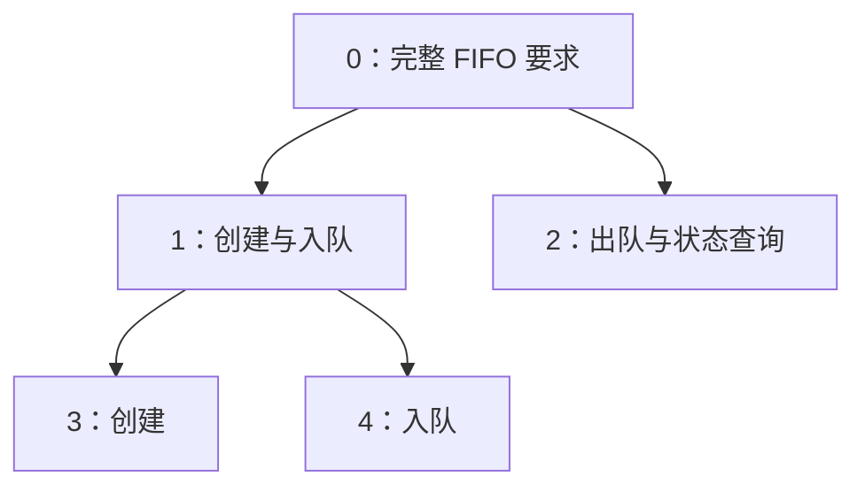

# R0 实现与验证范围

当前实现覆盖四类流程、工作视图、暂停恢复、规格变更、成果复用与交付导出。这里说明实际证明和外部契约；日常使用见[产品说明](product-guide.md)。[已审核规则](kernel-contract.md)是设计依据，不等同于对所有基础设施已经完成端到端形式证明。

已跑通的项目形状如下。完成三个叶子后，系统依次核验并关闭中间目标和根目标。



## 模块与实际调用

| 模块 | 当前职责 |
| --- | --- |
| `Model.lean` | 版本、工作包、证据、路线与历史记录的类型。 |
| `Transition.lean`、`Proofs.lean` | 单节点转换及其证明。 |
| `Workflow.lean` | 探索、在途操作、用户决定、暂停和访问规则的纯转换与证明。 |
| `Engine.lean` | 多节点转换、图不变量、请求去重和历史回放。 |
| `Git.lean` | 完整快照、对象绑定检查、源码树三方合并、私有索引和分支比较交换。 |
| `FifoPolicy.lean`、`Verifier.lean` | 从 Q0 六项要求构造核验目标，核验实际程序。 |
| `Refinement.lean` | 核验拆分关系与历史成果的接纳身份/适用性。 |
| `Controller.lean` | 调用核验器、自动向父目标传播、处理重试。 |
| `FlowIO.lean` | 流程候选、实验登记、原生记录接纳与对账。 |
| `Interface.lean` / `Diagnostics.lean` | 固定快照视图、材料访问守卫、失败原始诊断及实际被检源码交接、交付。 |
| `Main.lean` | 受信控制端 CLI。 |

上述模块均在 `Axiward/` 下，`Main.lean` 位于仓库根目录。

每个节点至多一个活动包，不同节点独立占用。动作固定为四种之一；阶段由封存状态及已准入的探索、待决定记录共同导出。没有过期回收。探索原语限定为登记的 FIFO 候选核验；纯分析可以用零次实验预算。用户问题目前只产生版本绑定的偏好，根变更仍走单独的用户确认命令。

基础单节点转换保留 `run` 的证明；共享源码接纳由 `integrateNode` 核对全部复核凭据。项目转换通过 `runGraph` 计算候选，再检查节点、边和成果依赖；只有满足 `GraphIntegrity` 才能构造正式状态。Git 保存初始规格与逐次转换记录，恢复时重新执行转换并核对结果，没有另一份可单独改写的当前状态缓存。

## 规则与证明对应

| 已覆盖的性质 | 规则 | 依据 |
| --- | --- | --- |
| 占用与闭合不重叠，结果绑定当前目标版本 | S1、S3、G3 | `run_preserves`、`current_result`、`graph_node_integrity` |
| 封存后不能替换终稿 | T4 | `sealed_cannot_be_replaced` |
| 被拒绝的核验释放占用，结束后迟到结果不能发布 | T5、T15 | `rejection_releases`、`ended_cannot_publish` |
| 执行发布必须有匹配版本和候选的通过结果 | G3、T5 | `accepted_binding` |
| 流程动作不修改命题、不发布产品、也不重分配编号 | G5、T10–T13 | `workflow_preserves`、`workflow_never_publishes` |
| 标为 worker 的请求不能作为用户答复或 harness 观测 | G1、T10、T13 | `worker_cannot_answer`、`worker_cannot_forge_observation`；身份由调用入口提供，完全访问模式下不证明无法绕行 |
| 取消保留过程义务，迟到观测不改变活动包 | T10、T15 | `cancel_preserves_obligations`、`late_observation_never_revives` |
| 暂停禁止新的工作包 | T16 | `pause_blocks_new_package` |
| 实验发起前必须有登记的准入方案 | T8、T9 | `launch_requires_admitted_plan` |
| 完成声明需要根证明及已结清的在途操作 | T18 | `complete_requires_proof_and_settlement` |
| 旧包不能凭旧核验发布到新版本 | T17 | `changed_scope_rejects` |
| 新建或复用节点均不能引入循环 | T6 | `route_rank_decreases`、`reachable_decreases`、`graph_acyclic` |
| 父结果绑定当前子成果和选定路线 | T14 | `composed_result_has_current_children` |
| 组合发布必须有匹配的核验通过结果 | T14 | `composition_requires_checked_output` |
| 模型不能直接批准精化或发布组合结果 | G1 | `worker_cannot_install_refinement`、`worker_cannot_compose` |
| 转换保留已有历史 | S5 | `Change.historyPrefix`、`step_preserves_history` |
| 当前成果的规格依赖符合最新根 | G3、T17 | `published_requirements_current` |
| 失效传播不改写包编号和活动包快照 | S3、T17 | `normalize_preserves_packages` |
| 合并复核覆盖全部当前成果，并绑定同份实际候选与各自范围 | P2 | `integrated_passed_requires_rechecks`、`rechecks_cover_required`、`rechecks_bind_merged_candidate` |
| 历史复用只引用正式接纳过的结果 | T7 | `priorAdmission`、`priorAdmission_iff`，由 `step` 强制检查 |

这些证明与构造约束覆盖上述实际实现；并非对任意依赖分析、任意外部副作用或操作系统权限的证明。预算、具体实验准入、用户答复适用性和完整交付条件由对应的纯转换守卫实施，跨流程检查验证它们的组合；上表仅列出已实际陈述并核验的定理。`Tests/Audit.lean` 检查内核声明的公理和运行实现替换；另用 `leanchecker Axiward` 复查本地模块。定理使用 Lean 的标准公理 `propext`、`Quot.sound`、`Classical.choice`，没有 `sorry`。

## 拆分与组合如何工作

精化提交包含 `plan.json` 和 `Refinement.lean`。前者选择子任务的要求组；后者证明：对于任意一组事实，满足这些子要求足以满足父要求。控制端生成固定目标，让 Lean 核验这个蕴含关系，并检查公理与证明模块。通过后才创建子节点。

每次子节点完成后，控制端寻找可组合的父节点，核对当前子结果与路线，组装证明源码，再核验父目标和实际程序。成功才发布父结果，并继续向上。它不会把“所有子任务通过”直接翻译为“整个项目通过”。

相同输入只自动尝试组合一次。条件恢复后可以提供新的组合请求 ID 再核验；未知或失败不等于命题已被证伪。相同 ID、相同请求返回原结果；复用 ID 提交不同请求会被拒绝。

当前 FIFO 接入将六项要求分成非空、不重叠的组。子项可以是新目标，也可以用 `{"reuse": 节点编号}` 引用已有目标。系统核对被引用目标的版本与要求；允许引用较早的节点，但计算图的层次并检查每条边下降，以拒绝循环。

执行成果先三方合入 `source/`。控制器按当前路线选出全部已接纳目标，将它们与新目标的条款组成联合 gate，实际构建、审计、重放同份合并候选；已有成果的凭据一起更新。未完成目标不加入联合 gate。父组合直接核验共享源码；`implementation` 子实现选择明确拒绝，旧的独立证明模块拼装器已删除。

初始化和变更严格匹配两个已登记根策略（忽略换行格式和首尾空白）：Q0 满时拒绝，以及验收用的“满时替换最旧元素”版本。容量为零仍拒绝。不支持的规格不会被悄悄替换；导入 Git 后再次核对实际内容。

恢复直接实现路线会保留原目标与已有子成果，不把撤下子目标当作完成。

## 规格变更与历史复用

目标记录对具体要求和检查器规范的版本依赖。FIFO 适配器从实际使用的命题定义和受信检查配置生成这些引用；未使用的另一项命题变化不会单独使本目标失效。引用完整性仍是适配器的明确契约。

`revise-preview` 执行同一份纯状态转换，列出变化的要求、失效结果、保留结果与过期工作包，不更新正式分支。用户入口用预览返回的 `reviewToken` 确认变更；该凭据同时绑定旧根和拟议新规格；其他节点提交不影响确认，但根被更新或新规格被替换时必须重新预览。

真正写入时再次检查当前状态，并从成功提交的那次转换生成影响报告。失效沿依赖传播，历史记录、产物和工作包原输入保留。过期结果不能发布；无关的进行中工作包仍可以完成。变更本身不会取消包或重新分配包编号。

历史产物复用同样属于精化。结果包可提供 `{"result":{"node": 原节点,"receipt":"原凭据ID"}}`，不同时提供子项或直接路线。控制端和内核都要求它来自历史上真正接纳的结果；仅检查通过但最终被拒绝的尝试不算接纳。

历史结果必须具有完全相同的已核验规格、策略和依赖，允许操作版本号不同。条件满足后，历史源码仍须进入同一共享合入与联合核验路径，生成绑定实际合并结果的新凭据。历史接纳身份本身不能证明这份源码与当前其他成果共同成立，不能用历史复用绕过新要求。

## Git 中保存什么

| 路径 | 内容 |
| --- | --- |
| `.axiward/state.json` | 初始规格、请求及转换结果，恢复时重放。 |
| `.axiward/policy/`、`.axiward/candidate/` | 根节点的策略与封存候选。 |
| `.axiward/route/` | 根节点当前精化关系的核验凭据。 |
| `.axiward/checks/<包编号>/` | 原始核验记录，失败也保存。 |
| `.axiward/compositions/<记录编号>/` | 父目标组合核验记录，失败也保存。 |
| `.axiward/receipt.json`、`product/` | 根的已发布凭据与实际产物。 |
| `.axiward/nodes/<节点编号>/` | 子节点对应的策略、候选、路线、记录与产物。 |

这些内容共用 `main` 的 Git 历史，旧路线和旧产物由历史提交保留。每次写入使用私有索引构造完整树，再比较旧提交更新引用；冲突后按最新状态重新检查。只改变状态时保留无关源码。

恢复同时检查规格、封存候选、正式 `source/`、精化凭据和交付物的实际对象摘要。普通仓库的 `.git/axiward-work/` 保存私有索引等临时文件，核验副本位于项目根 `.checks/`，交付默认位于 `delivery/`；这些可再生目录由新项目忽略，不参与正式状态判断。包根直接放候选文件，Git 内 `.axiward/candidate/` 的不可变证据结构保留。

当前持久化协议为 schema 3；程序明确拒绝加载 schema 1、2，不自动改写旧记录。

## CLI

```text
axiward init <新项目目录绝对路径> <受信策略目录> <Lean工具链目录>
axiward begin <仓库> <请求ID> <执行者ID> [节点编号=0 动作=execute]
axiward submit <仓库> <请求ID> <执行者ID> <包编号> <候选目录> [节点编号=0]
axiward check <仓库> <请求ID> <包编号> [节点编号=0]
axiward compose <仓库> <节点编号> [重新核验所用的新请求ID]
axiward revise-preview <仓库> <请求ID> <已登记策略目录>
axiward revise <仓库> <请求ID> <已登记策略目录> <预览的reviewToken>  # 仅用户入口
axiward status <仓库>
axiward cancel <仓库> <请求ID> <执行者ID> <包编号> <原因> [节点编号=0]
```

动作参数支持 `execute`、`refine`、`explore`、`requestDecision`。根编号为 `0`，各节点的工作包独立从 `0` 开始。完整用户命令见 `--help`，worker 工具与文件格式见产品说明。

基线策略和候选在 `examples/fifo/policy`、`candidate`；变更验收版本在 `policy-overwrite`、`candidate-overwrite`。精化候选在 `examples/fifo/refinement`；合入边界使用只覆盖已完成子项的候选，确认未完成条款不会被提前要求。

身份由受信调用方填写；CLI 是控制端接口，身份字符串本身不提供认证。薄 MCP 适配器在启动时绑定 worker 身份、仓库和视图；工具白名单不提供 `revise`、`decide` 或原始观测登记。用户答复来自原生 MCP elicitation 响应或独立用户终端。模型没有自填“通过”来发布成果的命令。

## 验证与边界

每项检查含准备不超过 30 秒，超时属于失败，不能计为性能达标。下表按实际执行阶段保留观测，并非最终源码 HEAD 的全量复验清单。`46阶段` 指形成 `46d022f` 的共享源码/诊断实现工作树；`00阶段` 指形成 `00bae01` 的依赖预检工作树；`布局阶段` 指形成 `e2338c3` 的目录内收工作树。两项内核短审计实际执行于 `e2338c3` 的最终编译树，此后仅更新文档；布局阶段没有重跑标为前两个阶段的检查。证据保留于 `.work/`，不入 Git、不自动清理。

| 检查 | 实际边界 | 秒 | 执行阶段 |
| --- | --- | ---: | --- |
| `Tests/Audit.lean` | 当前布局编译树的 2166 个内核声明审计，无 sorry 或额外公理。 | 5.752 | 布局阶段 |
| `leanchecker Axiward` | 独立重放当前布局编译树的证明。 | 4.156 | 布局阶段 |
| `store_scenarios` | 真实 Git CAS、幂等、源码/产物绑定、封存恢复、篡改拒绝。 | 19.768 | 46阶段 |
| `workflow_scenarios` | 交接作用域、未受影响包和混合历史序列化；状态样例不是通用证明。 | 0.077 | 46阶段 |
| `integration.py --case accepted` | 项目内 `.checks/` 的实际 Lean 构建、审计、证明重放、输入绑定、接纳、默认根内交付并运行。 | 25.015 | 布局阶段 |
| `integration.py --case wrong-fifo` | 新启动器实际拒绝错误证明，保持原始诊断中的 ⊢、α 及错误阶段。 | 11.796 | 布局阶段 |
| `layout.py` 四动作 | execute/refine/explore/requestDecision 各独立检查包根文件、真实封存字节及元数据排除；核验调用明确截断，不提供模拟 passed。 | 17.125 / 17.141 / 15.469 / 15.484 | 布局阶段 |
| `layout.py --case delivery` | 默认根内交付、实际输出路径、不覆盖、拒绝外部/保留路径；使用已接纳的 Git 夹具，不重复数学核验。 | 3.844 | 布局阶段 |
| `workflow.py --case intent` | 扁平包根 trials 路径的真实适配器/Git 意图重放，受控协议输入，不重新派发操作。 | 14.891 | 布局阶段 |
| `integration.py --case merged` | 真实三方合并与联合数学核验，双方源码保留、旧凭据更新、未完成条款不加入。前置已接纳记录为夹具。 | 27.500 | 46阶段 |
| `integration.py --case merge-breaks-prior` | B 的新目标之外，删除 A 的已接纳保证会被实际 Lean 拒绝；旧源码/成果不变。前置记录为夹具。 | 15.594 | 46阶段 |
| `integration.py --case assembled` | 夹具提供子成果，生产控制器实际核验共享源码的父目标并运行交付物。 | 25.359 | 46阶段 |
| `integration.py --case merge-conflict` | 真实 Git 内容冲突，结束包并保留原稿；不运行数学核验。 | 11.829 | 46阶段 |
| `integration.py --case merge-race` | 真实 Git/CAS 拒绝旧 HEAD 的结果并保留封存包；结果本身为协议夹具。 | 13.641 | 46阶段 |
| `workflow.py --case route` | 路线失效报告保留共享节点，真实 CLI 回收指定包；状态证明值为夹具。 | 6.047 | 46阶段 |
| 独立发行目录布局验收 | 脱离源码及 Lean/Python 环境的 exe 启动、两套策略初始化、session、真实适配器 stdio 的 status/next/cancel；没有原生 Codex 路由或模型轮次。 | 17.297 | e2338c3发行物 |
| `diagnostic_handoff.py --case acquisition` | 新包直接收到真实失败诊断；原稿与实际合并源码区分正确，完整原始证据可读。 | 13.063 | 46阶段 |
| `diagnostic_handoff.py` 访问拒绝 | evidence/history/candidate/previous-file/initial-source 各独立调用；current 别名无旁路、首次源码填充不绕过拒绝、恢复后仍读取固定基线。 | 14.344 / 14.453 / 12.328 / 11.890 / 12.297 | 46阶段 |
| `runtime_dependency.py --case preflight` | 子进程 PATH 缺 Codex 时，初始化/session/新包/新封存均提前拒绝；已登记 begin/submit 重放、next 恢复和请求冲突检查保持原语义。 | 20.422 | 00阶段 |
| `runtime_dependency.py --case late` | 封存后入口消失，真实 CLI 返回具体 Codex/PATH 原因并存入证据；未启动核验阶段，旧包按 unresolved 结束。 | 17.609 | 00阶段 |
| `Tests/Diagnostics.lean` | 真实 Git 证据中的完整诊断、实际合并输入、位置、目标/前提及缺失信息；消息为协议夹具。 | 3.487 | 46阶段 |

本轮包工作区整理另做以下独立复核；上表仍是各自旧阶段的观测，不代表本轮全部重跑。以下检查均含各自准备过程、单次小于 30 秒，无模型推理：

| 检查 | 实际边界 | 秒 |
| --- | --- | ---: |
| 编译、内核审计与证明重放 | `lake build axiward verifier_boundary`；`Tests/Audit.lean` 审计 2166 个声明，无 `sorry` 或额外公理；`leanchecker Axiward` 独立重放。 | 19.687 / 4.500 / 5.047 |
| `layout.py` 四动作 | execute/refine/explore/requestDecision 的真实 CLI、适配器和 Git 封存 IO；根目录、包内元数据路径及封存白名单正确。check 派发明确截断为 `verificationNotRun`，不冒充数学核验。 | 16.812 / 15.469 / 15.610 / 15.390 |
| `status_snapshot.py` | 已绑定包的只读查询与真实暂停交错；状态和交接同快照，项目地图、动作、路径完整，包文件字节与 mtime 不变；拒绝访问条款时返回 `null`。 | 19.156 |
| `integration.py --case merge-breaks-prior` | 真实 Lean 拒绝破坏旧保证的合并候选，保留原始诊断；前置已接纳状态是明确的协议夹具。 | 18.953 |
| `diagnostic_handoff.py` 的 initial-source / acquisition / evidence | 从本轮真实失败只读恢复完整诊断；损坏或删除本地 view 不改变正式查询，恢复保留草稿且不复活已删候选，源码及证据访问拒绝仍生效。各 case 新建受管测试项目，不重跑核验；完整证据只在显式请求时导出。 | 25.016 / 15.875 / 20.187 |

`merged` 首跑被 28 秒保护终止，不计通过；保留核验全部阶段后减少重复规格摘要生成，第二次才通过。不可变诊断投影另在 `merge-breaks-prior` 的真实失败上只读核对，1.467 秒：实际合并候选不同于原稿，读取 `Gate.lean:12:48` 的缺失定理诊断，HEAD 不变且未重跑核验。新包完整交接和访问拒绝的六个独立边界均由 `Tests/diagnostic_handoff.py` 验证，包含 Git clone、session 和 next；原失败项目 HEAD 不变，未生成新的核验目录。可先运行 `integration.py --case merge-breaks-prior`，再用 `python Tests/diagnostic_handoff.py --repo <该检查输出>/project --output <新目录> --case acquisition`；其他 case 为 evidence、history、candidate、previous-file、initial-source。纯诊断投影入口是 `lake env lean --run Tests/Diagnostics.lean <新目录>`。

Codex 依赖检查仅运行 `codex --version`，确认当前进程能启动该入口；不安装或发现其他位置的 CLI，不写全局环境，不替代实际核验。`Sandbox` 在真正启动外部进程时也保留具体错误。缺失入口的检查只改变新建 `.work/` 项目的子进程环境，未操作用户正在使用的项目。

目录内收的正常核验曾遇父 deny 继承和 PowerShell cwd 降级，相关失败以及两次 28 秒超时均不计通过。最终方案只对新空 snapshot 设置精确 ACL，并直接绑定核验子进程 cwd；完整 profile、核验阶段和输入绑定检查保留，详见[核验进程边界](permissions.md#候选核验进程)。移除了 check 入口重复加载同一状态，以及 accepted 边界中已由实际 deliver 执行的重复完整加载；没有删去交付运行和绑定断言。新检查证据在 `.work/nested-checks-*`、`.work/root-layout-*`，不自动清理。

### 证明和外部边界

- `Proofs.lean`、`Workflow.lean`、`Engine.lean` 的定理针对实际纯转换。新增复核定理说明成功通过复核守卫时，凭据集合覆盖控制器当前路线的全部已接纳成果，并逐项绑定范围与合并候选；它们不证明 Git 合并或外部 Lean 进程的实现正确。
- `accepted_binding` 对应基础 `finish` 的原候选绑定；新合入还依赖 `integrateNode`、实际联合 gate 核验与精确 HEAD 的 CAS。不能拿基础定理冒充全部合入路径的端到端证明。
- 前置协议 `passed` 只建立可控状态，不证明候选正确性。真实数学检查与真实 Git/进程/入口检查分别报告，失败现场提取始终只读既有证据。
- 检查分层 checkpoint `34ee404` 已补 `launch_within_budget`、`applicable_answer_binding`、`replay_preserves_state` 并删除重复纯状态样例。它不是检查重整全部完成的凭据：旧 handoff 检查最后超时，原生 MCP 的最终树复验和旧覆盖审计仍有缺口。旧 Parts 拼装相关覆盖已随拼装器删除；满时覆盖策略的实际可执行交付和所有在途操作阻止发布的完整性质，不能由本轮的原策略结果或仅有 `complete` 定理替代。

`rootClosed` 是当前根的有效证明，`complete` 仍要求当前路线无活动包及所有已登记在途操作结清；旧路线 worker 的停止或回收不另加等待。Axiward 只报告失效包，Discussion agent 管理 Codex worker，`reclaim` 只释放包占用并保留操作义务。

Git、CLI/适配器、完整 Lean 发行版、Codex 原生执行通道与操作系统仍是外部信任前提。当前固定 FIFO 规格族不代表任意软件验证；worker 完全访问模式依靠说明约定，权限隔离检查按用户要求跳过。
