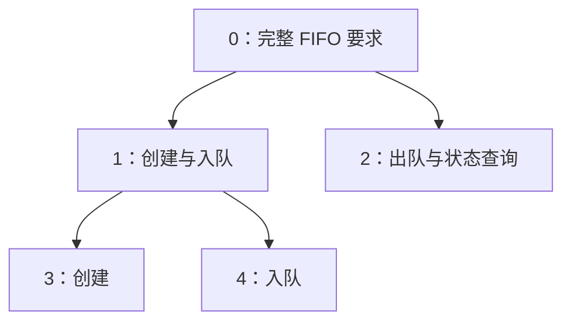

# R0 实现与验证范围

当前实现覆盖四类流程、工作视图、暂停恢复、规格变更、成果复用与交付导出。这里说明实际证明和外部契约；日常使用见[产品说明](product-guide.md)。[已审核规则](kernel-contract.md)是设计依据，不等同于对所有基础设施已经完成端到端形式证明。

已跑通的项目形状如下。完成三个叶子后，系统依次核验并关闭中间目标和根目标。



## 模块与实际调用

| 模块 | 当前职责 |
| --- | --- |
| `Model.lean` | 版本、工作包、证据、路线与历史记录的类型。 |
| `Transition.lean`、`Proofs.lean` | 单节点转换及其证明。 |
| `Workflow.lean` | 探索、在途操作、用户决定、暂停和访问规则的纯转换与证明。 |
| `Engine.lean` | 多节点转换、图不变量、请求去重和历史回放。 |
| `Git.lean` | 完整快照、对象绑定检查、私有索引和分支比较交换。 |
| `FifoPolicy.lean`、`Verifier.lean` | 从 Q0 六项要求构造核验目标，核验实际程序。 |
| `Refinement.lean` | 核验拆分关系，组装已核验源码。 |
| `Controller.lean` | 调用核验器、自动向父目标传播、处理重试。 |
| `FlowIO.lean` | 流程候选、实验登记、原生记录接纳与对账。 |
| `Interface.lean` | 明确选择后的工作包领取、固定快照视图、材料检索、原始诊断与交付。 |
| `Main.lean` | 受信控制端 CLI。 |

上述模块均在 `Axiward/` 下，`Main.lean` 位于仓库根目录。

每个节点至多一个活动包，不同节点独立占用。动作固定为四种之一；阶段由封存状态及已准入的探索、待决定记录共同导出。没有过期回收。探索原语限定为登记的 FIFO 候选核验；纯分析可以用零次实验预算。用户问题目前只产生版本绑定的偏好，根变更仍走单独的用户确认命令。

普通执行仍调用已证明的 `run`。项目转换通过 `runGraph` 计算候选，再检查节点、边和成果依赖；只有满足 `GraphIntegrity` 才能构造正式状态。Git 保存初始规格与逐次转换记录，恢复时重新执行转换并核对结果，没有另一份可单独改写的当前状态缓存。

## 规则与证明对应

| 已覆盖的性质 | 规则 | 依据 |
| --- | --- | --- |
| 占用与闭合不重叠，结果绑定当前目标版本 | S1、S3、G3 | `run_preserves`、`current_result`、`graph_node_integrity` |
| 封存后不能替换终稿 | T4 | `sealed_cannot_be_replaced` |
| 被拒绝的核验释放占用，结束后迟到结果不能发布 | T5、T15 | `rejection_releases`、`ended_cannot_publish` |
| 执行发布必须有匹配版本和候选的通过结果 | G3、T5 | `accepted_binding` |
| 流程动作不修改命题、不发布产品、也不重分配编号 | G5、T10–T13 | `workflow_preserves`、`workflow_never_publishes` |
| 标为 worker 的请求不能作为用户答复或 harness 观测 | G1、T10、T13 | `worker_cannot_answer`、`worker_cannot_forge_observation`；身份由调用入口提供，完全访问模式下不证明无法绕行 |
| 取消保留过程义务，迟到观测不改变活动包 | T10、T15 | `cancel_preserves_obligations`、`late_observation_never_revives` |
| 暂停禁止新的工作包 | T16 | `pause_blocks_new_package` |
| 实验发起前必须有登记的准入方案 | T8、T9 | `launch_requires_admitted_plan` |
| 完成声明需要根证明及已结清的在途操作 | T18 | `complete_requires_proof_and_settlement` |
| 旧包不能凭旧核验发布到新版本 | T17 | `changed_scope_rejects` |
| 新建或复用节点均不能引入循环 | T6 | `route_rank_decreases`、`reachable_decreases`、`graph_acyclic` |
| 父结果绑定当前子成果和选定路线 | T14 | `composed_result_has_current_children` |
| 组合发布必须有匹配的核验通过结果 | T14 | `composition_requires_checked_output` |
| 模型不能直接批准精化或发布组合结果 | G1 | `worker_cannot_install_refinement`、`worker_cannot_compose` |
| 转换保留已有历史 | S5 | `Change.historyPrefix`、`step_preserves_history` |
| 当前成果的规格依赖符合最新根 | G3、T17 | `published_requirements_current` |
| 失效传播不改写包编号和活动包快照 | S3、T17 | `normalize_preserves_packages` |
| 历史复用只引用正式接纳过的结果 | T7 | `priorAdmission`、`priorAdmission_iff`，由 `step` 强制检查 |

这些证明与构造约束覆盖上述实际实现；并非对任意依赖分析、任意外部副作用或操作系统权限的证明。预算、具体实验准入、用户答复适用性和完整交付条件由对应的纯转换守卫实施，跨流程检查验证它们的组合；上表仅列出已实际陈述并核验的定理。`Tests/Audit.lean` 检查内核声明的公理和运行实现替换；另用 `leanchecker Axiward` 复查本地模块。定理使用 Lean 的标准公理 `propext`、`Quot.sound`、`Classical.choice`，没有 `sorry`。

## 拆分与组合如何工作

精化提交包含 `plan.json` 和 `Refinement.lean`。前者选择子任务的要求组；后者证明：对于任意一组事实，满足这些子要求足以满足父要求。控制端生成固定目标，让 Lean 核验这个蕴含关系，并检查公理与证明模块。通过后才创建子节点。

每次子节点完成后，控制端寻找可组合的父节点，核对当前子结果与路线，组装证明源码，再核验父目标和实际程序。成功才发布父结果，并继续向上。它不会把“所有子任务通过”直接翻译为“整个项目通过”。

相同输入只自动尝试组合一次。条件恢复后可以提供新的组合请求 ID 再核验；未知或失败不等于命题已被证伪。相同 ID、相同请求返回原结果；复用 ID 提交不同请求会被拒绝。

当前 FIFO 接入将六项要求分成非空、不重叠的组。子项可以是新目标，也可以用 `{"reuse": 节点编号}` 引用已有目标。系统核对被引用目标的版本与要求；允许引用较早的节点，但计算图的层次并检查每条边下降，以拒绝循环。

默认组合仍要求相同实现。需要把保留的证明材料用于新实现时，精化方案必须用 `implementation` 指定一个子项的位置作为实现来源；系统会把所有证明源码放到该实现下重新核验父目标。选错实现会导致组合失败，不能把旧证书直接当成新程序的证明。

初始化和变更严格匹配两个已登记根策略（忽略换行格式和首尾空白）：Q0 满时拒绝，以及验收用的“满时替换最旧元素”版本。容量为零仍拒绝。不支持的规格不会被悄悄替换；导入 Git 后再次核对实际内容。

恢复直接实现路线会保留原目标与已有子成果，不把撤下子目标当作完成。

## 规格变更与历史复用

目标记录对具体要求和检查器规范的版本依赖。FIFO 适配器从实际使用的命题定义和受信检查配置生成这些引用；未使用的另一项命题变化不会单独使本目标失效。引用完整性仍是适配器的明确契约。

`revise-preview` 执行同一份纯状态转换，列出变化的要求、失效结果、保留结果与过期工作包，不更新正式分支。用户入口用预览返回的 `reviewToken` 确认变更；该凭据同时绑定旧根和拟议新规格；其他节点提交不影响确认，但根被更新或新规格被替换时必须重新预览。

真正写入时再次检查当前状态，并从成功提交的那次转换生成影响报告。失效沿依赖传播，历史记录、产物和工作包原输入保留。过期结果不能发布；无关的进行中工作包仍可以完成。变更本身不会取消包或重新分配包编号。

历史产物复用同样属于精化。结果包可提供 `{"result":{"node": 原节点,"receipt":"原凭据ID"}}`，不同时提供子项或直接路线。控制端和内核都要求它来自历史上真正接纳的结果；仅检查通过但最终被拒绝的尝试不算接纳。

历史结果必须具有完全相同的已核验规格、策略和依赖，允许操作版本号不同。条件满足时接纳原产物并生成新绑定凭据，原源码、证明和二进制不重建。规格不同必须重新核验，不能用历史复用绕过新要求。

## Git 中保存什么

| 路径 | 内容 |
| --- | --- |
| `.axiward/state.json` | 初始规格、请求及转换结果，恢复时重放。 |
| `.axiward/policy/`、`.axiward/candidate/` | 根节点的策略与封存候选。 |
| `.axiward/route/` | 根节点当前精化关系的核验凭据。 |
| `.axiward/checks/<包编号>/` | 原始核验记录，失败也保存。 |
| `.axiward/compositions/<记录编号>/` | 父目标组合核验记录，失败也保存。 |
| `.axiward/receipt.json`、`product/` | 根的已发布凭据与实际产物。 |
| `.axiward/nodes/<节点编号>/` | 子节点对应的策略、候选、路线、记录与产物。 |

这些内容共用 `main` 的 Git 历史，旧路线和旧产物由历史提交保留。每次写入使用私有索引构造完整树，再比较旧提交更新引用；冲突后按最新状态重新检查。只改变状态时保留无关源码。

恢复同时检查规格、候选、精化凭据和交付物的实际对象摘要。普通仓库的 `.git/axiward-work/` 保存私有索引等临时文件，核验副本位于仓库旁的 `<repo>.checks/`；二者不参与正式状态判断。

当前持久化协议为 schema 3；程序明确拒绝加载 schema 1、2，不自动改写旧记录。

## CLI

```text
axiward init <新项目目录绝对路径> <受信策略目录> <Lean工具链目录>
axiward begin <仓库> <请求ID> <执行者ID> [节点编号=0 动作=execute]
axiward submit <仓库> <请求ID> <执行者ID> <包编号> <候选目录> [节点编号=0]
axiward check <仓库> <请求ID> <包编号> [节点编号=0]
axiward compose <仓库> <节点编号> [重新核验所用的新请求ID]
axiward revise-preview <仓库> <请求ID> <已登记策略目录>
axiward revise <仓库> <请求ID> <已登记策略目录> <预览的reviewToken>  # 仅用户入口
axiward status <仓库>
axiward cancel <仓库> <请求ID> <执行者ID> <包编号> <原因> [节点编号=0]
```

动作参数支持 `execute`、`refine`、`explore`、`requestDecision`。根编号为 `0`，各节点的工作包独立从 `0` 开始。完整用户命令见 `--help`，worker 工具与文件格式见产品说明。

基线策略和候选在 `examples/fifo/policy`、`candidate`；变更验收版本在 `policy-overwrite`、`candidate-overwrite`。精化候选在 `examples/fifo/refinement`；集成检查从完整候选中提取所需的分组证明。

身份由受信调用方填写；CLI 是控制端接口，身份字符串本身不提供认证。薄 MCP 适配器在启动时绑定 worker 身份、仓库和视图；工具白名单不提供 `revise`、`decide` 或原始观测登记。用户答复来自原生 MCP elicitation 响应或独立用户终端。模型没有自填“通过”来发布成果的命令。

## 验证与边界

用户要求每项检查不超过 30 秒；超限项必须优化或删除，覆盖取舍不明时交用户审核。检查分层方案已批准并在实施。下表是重整前已有短检查的最后通过记录；新边界入口的最终覆盖与耗时需在实施完成后更新，不能据旧记录宣称新改动已经全部通过。

| 检查 | 独立覆盖 | 秒 |
| --- | --- | ---: |
| `Tests/Audit.lean` | 内核声明没有 `sorry` 或额外公理。 | 5.96 |
| `leanchecker Axiward` | 独立重放已编译证明。 | 4.33 |
| `workflow_scenarios` | 纯状态异常、预算、迟到结果、重放及交接作用域。 | 0.17 |
| `store_scenarios` | 真实 Git 的 CAS、幂等、源码保留、封存恢复与日志篡改拒绝。 | 12.80 |
| `Tests/status_snapshot.py` | 实际提交穿插在读取之间，响应仍对应同一版本；读取不消费状态。 | 7.05 |
| `Tests/handoff.py` | 显式领取、结束包不复活、新 worker 获得拒绝原因与不可变旧候选。 | 24.38 |
| `Tests/native.py` | 实际 Codex MCP 路由、独立用户问答、答复持久化与交接。 | 24.00 |

快照与交接检查删除了重复的完整流程准备；状态组合仍由已有 Lean 纯检查覆盖。Python 功能检查设有整体时间预算，超时会失败，不算通过。原生问答由测试客户端明确模拟，不使用模型轮次。可再生证据在 `.work/cli-layout-checks-20260919-004846/`，不自动清理。

外部边界检查按独立问题组织，避免为每种状态重新构建、审计并重放完整 FIFO。不能仅保留成功链而丢掉必要的失败与 IO 边界覆盖，也不能把超时中止当作性能达标。

### 定理与运行检查如何分工

`Proofs.lean`、`Workflow.lean`、`Engine.lean` 中的定理针对生产实际调用的纯转换函数，由 Lean 检查证明。`Tests/WorkflowScenarios.lean` 的 `ensure` 则是运行时样例断言；写成 Lean 不等于已有定理，把有限样例改成编译时求值也不等于证明所有输入。

| 性质 | 当前依据 | 精简时的边界 |
| --- | --- | --- |
| 封存不可换、拒绝释放、旧范围结果被拒绝 | `sealed_cannot_be_replaced`、`rejection_releases`、`changed_scope_rejects` | 单纯重复这些纯状态结论的用例可以删除；文件是否真的按封存对象读取仍需 IO 检查。 |
| 无环、父结果绑定当前路线与子成果 | `graph_acyclic`、`composed_result_has_current_children` | 可替代重复的图状态样例，不证明源码组装器或外部 Lean 进程正确。 |
| 取消保留在途义务、迟到观测不复活包、暂停阻止新包 | 对应 `cancel_preserves_obligations`、`late_observation_never_revives`、`pause_blocks_new_package` | 纯状态性质已有证明；实际进程返回后证据是否落盘、断线后是否重复启动仍是 IO 问题。 |
| 请求重放幂等、预算精确上限、答复适用条件 | 纯转换守卫与部分样例 | 可作为补充通用定理的候选；尚不能宣称这些完整性质都已证明。 |
| Git 引用竞争、文件内容绑定、进程结果映射、MCP/用户问答路由、导出程序可运行 | 外部设施与 IO 接入实现 | 现有状态定理不能替代实际边界检查。 |

`accepted_binding` 证明的是：接纳必须收到匹配当前范围和候选的 `passed` 结果。它不证明验证器确实核验了实际文件。候选代码的证明检查发生在候选生成以后，不能用控制器自身编译通过来代替。能从回归套件移除的是重复用例，不能因此删除对动态输入的准入守卫或候选核验。

### 已批准的检查分层

1. 将状态断言对应到生产函数的已有定理，删除只重复这些性质的运行样例。
2. 对必要纯逻辑缺口补充通用定理，不把有限样例求值或独立模型冒充生产实现的证明。
3. 保留独立的真实外部边界检查，包括验证器接纳、错误证明与审计拒绝、源码组装、Git 绑定与竞争、迟到结果归档、操作不重跑以及 MCP 用户问答。用可控短进程隔离结果处理，避免反复执行完整长链；包含准备和清理的每次检查不得超过 30 秒。

协议夹具可以提供已知前置状态或可控结果，以单独检查实际 IO 处理；模拟 `passed` 不构成候选正确性的证据。数学核验路径必须另外真实运行并分别记录。不能靠缓存验证结果、遗漏绑定检查或默认全跑长链来满足时间要求。

已移除超过 30 秒、且退出本轮范围的 `Tests/isolation/verifier.py` 与 `parallel_check.py` 及其专用记录 helper。SID 启动诊断仍保留在 `experiments/`；生产入口模式已有 6.4 秒记录，已加整体时间预算，本轮按权限检查跳过要求不重跑。

Git、原生执行通道、控制端与完整 Lean 发行版仍是明确的外部信任前提。标准库、编译器及运行时正确性不由本内核证明。当前 worker 使用完全访问模式，依靠说明约定通过薄适配器推进项目；核验候选的子进程仍使用既有原生限制。实现边界和检查入口见[执行模式](permissions.md)。

`Tests/WorkflowScenarios.lean` 的场景断言不是定理证明；形式化保证与真实边界检查分别记录。旧长链的通过记录不能替代当前版本或已精简检查的覆盖声明。

`rootClosed` 表示当前精化图的根有有效结果。`complete` 还要求当前路线没有活动工作包，所有已登记的在途实验均已完成或明确对账；无关的历史支线不要求全部闭合。交付绑定具体 Git 快照与产物摘要。Worker 负责选择后续工作，控制器只核验操作与成果，不保证开放问题必然收敛。

存储、进程身份、完整原生记录、资源访问、编译及产品导出对应关系仍由外部契约和集成检查支撑。当前是有限 FIFO 规格族，不能据此宣称支持任意软件需求的影响分析。根规格和 checker 不能由 worker 自定义来绕过已登记目标。
