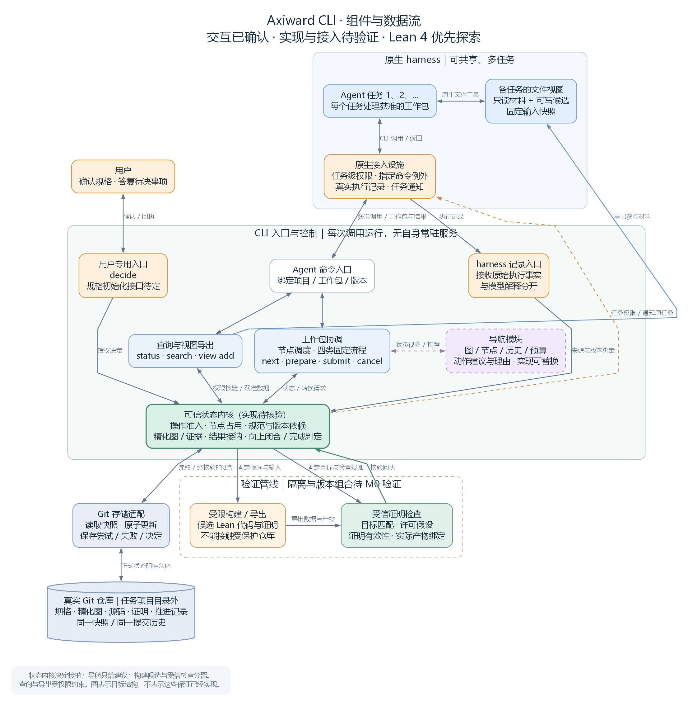
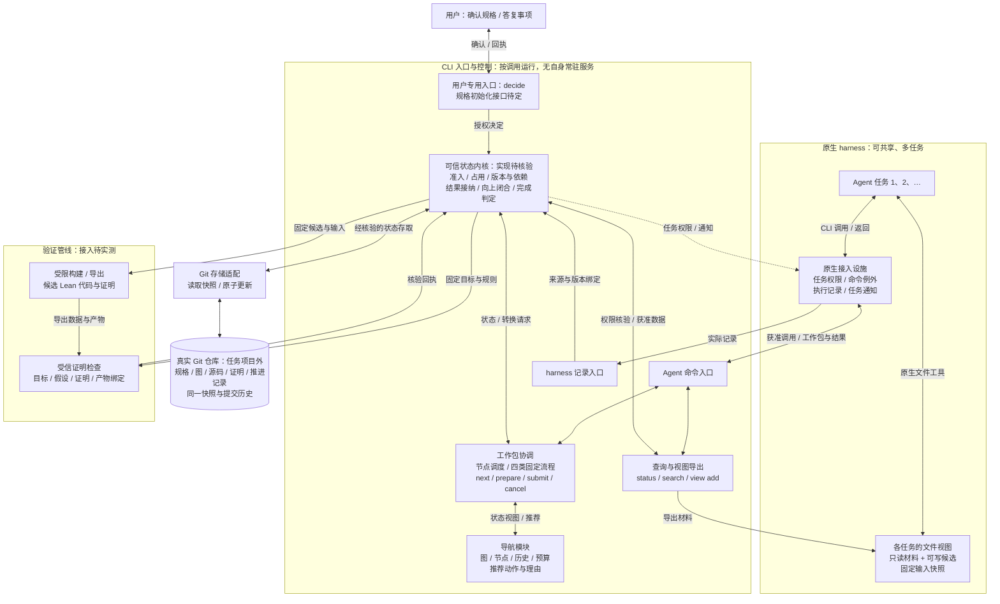

# Axiward CLI 架构图

2026-09-18 · 总体组件与数据流已获用户认可，CLI 暂定 Lean。M0 结果见 [原型验证汇总](axiward-m0-results.md)；正式状态内核与完整 CLI 尚待实现。

当前原型采用完全访问权限＋访问规则文本。用户允许 harness 托管薄 MCP 适配进程，按次调用 CLI；强制隔离后补。下图保留目标职责划分，不代表所有保护机制已经实现。

[SVG 矢量图，可放大查看](axiward-cli-architecture.svg)

## 读图方式

1. **Agent 操作文件视图。** 真实仓库在任务项目目录外；harness 可通过限定的工具入口调用 CLI。当前访问边界依规则文本约束，原生强制权限后补。
2. **CLI 负责项目操作。** 查询与导出需要权限核验；工作包协调负责调度和固定流程；导航只提供建议。
3. **状态内核决定正式接纳。** 权限、节点占用、根与证据版本、精化关系及完成条件，统一进入合法状态转换。
4. **验证分为两个信任区域。** 候选代码在受限环境中构建、导出；受信检查器核对目标、假设、证明和实际产物的对应关系。
5. **Git 保存权威状态。** 存储适配器根据内核认可的转换，提交源码、规格、图和记录的统一快照。
6. **人和 harness 有各自入口。** `decide` 只接收用户决定；实际执行事实来自 harness，与 agent 的解释分开。决定入库后通知原任务。

图中的框是职责划分，不要求每个框成为独立服务或软件包。存储与验证适配均由 CLI 调用；候选构建的受限执行域是目标设计，当前原型暂未强制。CLI 按调用运行，harness 托管的薄适配器、临时进程、锁和缓存不替代 Git 中的权威状态。

## 命令与职责

| 命令 | 主路径 |
| --- | --- |
| `status` | 查询 → 内核权限核验 → 当前状态 |
| `search` | 查询 → 可读快照的目录与索引 → 资源线索 |
| `view add` | 查询 → 权限与版本核验 → 向任务视图导出材料 |
| `next` | 节点调度 → 导航建议 → 内核准入 / 登记占用 → 工作包与视图 |
| `prepare` | 探索方案 → 准入核验 → 获准的实验契约 |
| `submit` | 固定候选 → 验证与证据检查 → 合法状态转换 → Git 提交或失败记录 |
| `cancel` | 内核结束工作包 → 保留候选与记录 → 释放占用 |
| `decide` | 用户决定 → 来源 / 作用范围 / 版本核验 → 更新状态 → 通知原任务 |

命令名称与数据格式仍是草案。项目初始化入口尚未定稿。

## Mermaid 版本

## 与实施路线的对应

| 阶段 | 覆盖图中的部分 |
| --- | --- |
| M0：探索与接入验证 | Lean 构建及审查、原生权限、执行记录、用户决定与通知 |
| M1：状态内核 | 核心状态与不变量、合法转换、Git 存储与恢复对应关系 |
| M2：CLI 工作流程 | 查询 / 视图、四类工作包、调度与导航、用户入口 |
| M3：实际验收 | 用 Q0 队列项目贯通系统，验证错误拒绝、规格变更、暂停恢复和并行行为 |

依据：[交付目标与路线图](axiward-delivery-plan-draft.md)、[M0 工作包](axiward-m0-work-packages.md)、[系统设计](https://github.com/vorton-lang/axiward/discussions/1)、[CLI 设计](https://github.com/vorton-lang/axiward/discussions/2)。
